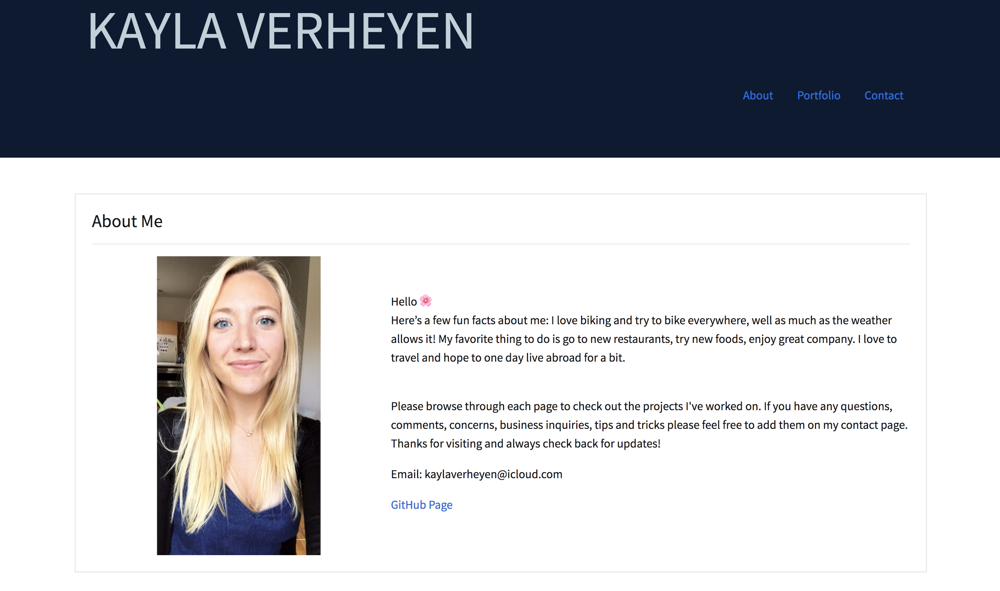
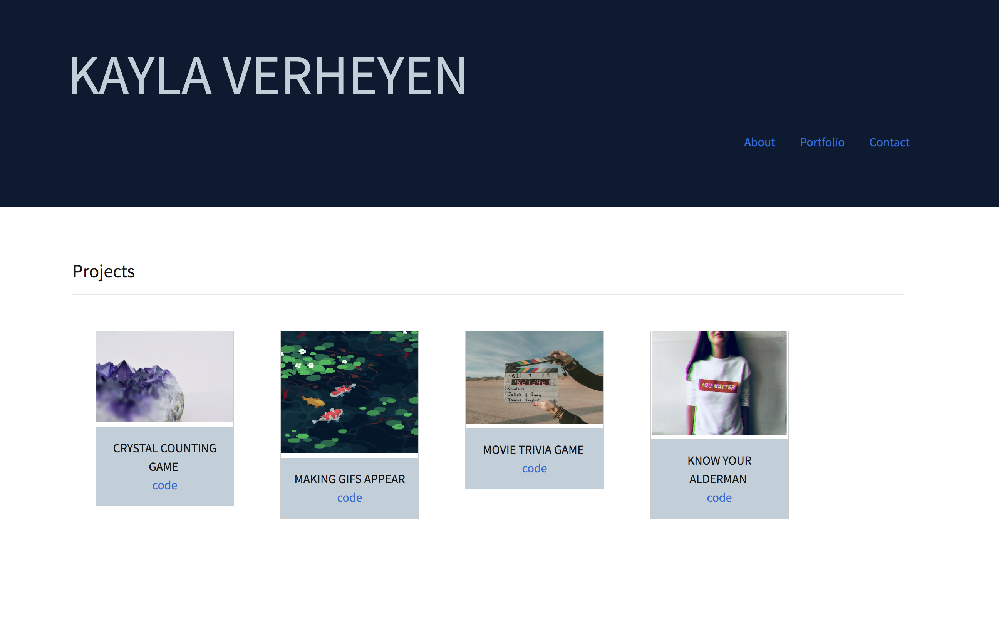
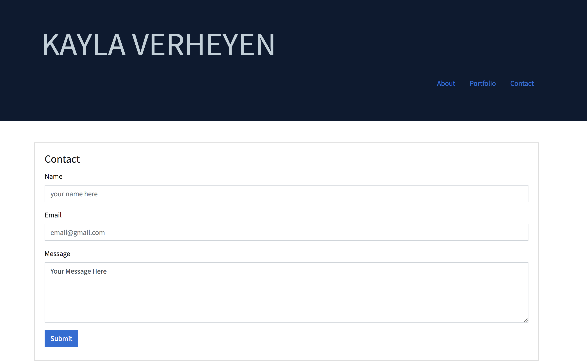

#Portfolio#

Created for: Northwestern Coding Bootcamp \
Developers: Kayla Verheyen \
Deployment Date:  November 1, 2018 \
Published: GitHub  https://kaylaverheyen.github.io/bootstrap_portfolio/ \
Frontend Technologies: HTML5, CSS3, Bootstrap \

Projects: \
Frontend Technologies Showcased Within The Projects Section: HTML5, CSS3, Bootstrap, Javascript, jQuery \
Backend Technologies Showcased Within The Projects Section: AJAX, Google Map API, Data.Chicago API, News API, Firebase, Charts.js 

## Summary: 
My Portfolio showcases my Full Stack Development. Please contact me with questions: kaylaverheyen@icloud.com

### Screen 1: Portfolio Page 

* Navigate to more informational pages through the nav-bar.

* This page uses Bootstrap and CSS3.

 

### Screen 2: Projects

* Crystal Game\

* Making Gifs Appear \

* Movie Trivia Game \

* Know your Alderman-- Grop Project 1: I personally worked on the survey page which utilizes: Firebase, chart.js, and JQuery. \

 

### Screen 4: Contact Page

* Please fill in your name, email, and your message or comment and submit to my email.

 

## Project insights:
I will continue to add to the project page and update my portfolio as improve as a full stack developer. 
